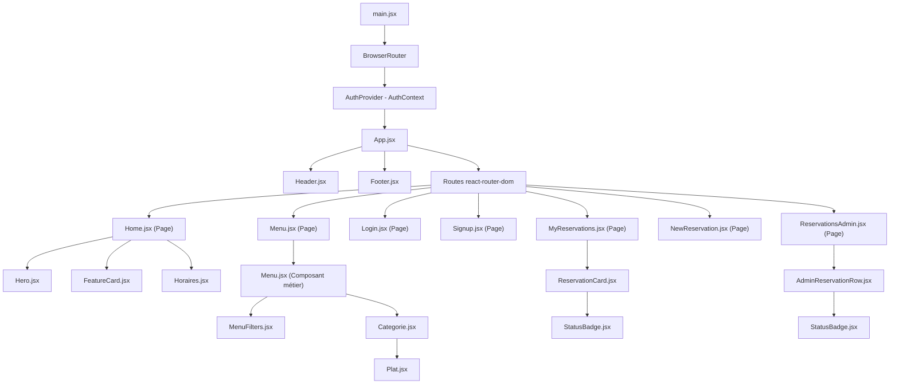

# MOYA - Front-End (React + Vite)

Ce projet est la partie cliente (Front-End) de l'application de réservation pour le restaurant **MOYA**. Il a été développé avec **React 19**, **Vite** et du **CSS pur** (Vanilla CSS) pour des performances optimales et une esthétique soignée (mode sombre raffiné, transitions fluides et responsive design).

---

## Installation & Démarrage

### Prérequis
* [Node.js]
* Le serveur backend (projet `projet_final_restaurant`) lancé en parallèle sur le port `3000`.

### 1. Installation des dépendances
Ouvrez votre terminal dans le dossier racine du projet front-end et exécutez la commande suivante :
```bash
npm install
```

### 2. Démarrage de l'application en mode développement
Pour lancer le serveur de développement local de Vite :
```bash
npm run dev
```
Par défaut, l'application est accessible à l'adresse : [http://localhost:5173/](http://localhost:5173/). 

---

### 👤 Comptes de Test / Connexion
Pour tester l'application (client et administrateur), vous pouvez utiliser les identifiants par défaut suivants (configurés en base de données) :

* **Compte Client :**
  * **Email :** `client@restaurant.local`
  * **Mot de passe :** `ClientPassword123!`
* **Compte Administrateur :**
  * **Email :** `admin@restaurant.local`
  * **Mot de passe :** `AdminPassword123!`
 
---

## Documentation des Routes Front-End

Le routage est géré avec `react-router-dom` (v6). Voici la liste des routes déclarées :

| Chemin (URL) | Page | Type d'accès | Description |
| :--- | :--- | :--- | :--- |
| `/` | **Accueil** (`Home.jsx`) | Public | Présentation du restaurant (philosophie, horaires, adresse). |
| `/menu` | **La Carte** (`Menu.jsx`) | Public | Affiche le menu du restaurant avec filtres par catégories et par prix max. |
| `/login` | **Connexion** (`Login.jsx`) | Public | Formulaire d'authentification pour accéder aux espaces privés. |
| `/signup` | **Inscription** (`Signup.jsx`) | Public | Création de compte client avec numéro de téléphone (optionnel). |
| `/my-reservations` | **Mes Réservations** (`MyReservations.jsx`) | Connecté (Client) | Liste de toutes les réservations du client (en attente, validées ou annulées) et action d'annulation. |
| `/reservations/new` | **Nouvelle Réservation** (`NewReservation.jsx`) | Connecté (Client) | Formulaire pour réserver une table (avec nombre de convives amélioré et saisie de téléphone). |
| `/reservations` | **Admin Réservations** (`ReservationsAdmin.jsx`) | Connecté (Admin uniquement) | Tableau de bord de gestion pour valider ou rejeter les demandes clients. |
| `*` | **Redirection** | Public | Redirige toutes les URL inconnues vers la page d'accueil (`/`). |

### Sécurité et Protections d'accès
* **Espace Client (`/reservations/new` et `/my-reservations`) :** Si un visiteur non connecté tente d'accéder à ces pages, il est automatiquement redirigé de manière invisible vers `/login`.
* **Espace Admin (`/reservations`) :** Cette page est strictement restreinte. Un utilisateur non connecté est redirigé vers `/login`, tandis qu'un utilisateur connecté avec le rôle standard `client` est redirigé vers la page d'accueil `/`.

---

## Architecture et Arborescence des Composants

L'application est structurée autour d'un contexte d'authentification global (`AuthProvider`) qui distribue l'état de l'utilisateur sur l'ensemble de l'arbre.

### Schéma de l'arborescence (Composants React)



### Rôle des Composants Principaux

* **`AuthProvider` (dans `context/AuthContext.jsx`) :** Gère le stockage sécurisé du token dans le `localStorage`, son décodage (payload de l'utilisateur), et expose les fonctions de `login` / `logout` ainsi que les indicateurs de rôle (`isAdmin`). Il intègre également un mécanisme s'assurant de vider la session au rechargement complet de l'application (cycle de vie temporisé).
* **`Header` (dans `components/Header.jsx`) :** Barre de navigation adaptative. Elle s'adapte dynamiquement si l'utilisateur est authentifié et/ou s'il est administrateur. Le bouton de déconnexion redirige automatiquement vers `/`.
* **`Menu` (dans `components/Menu.jsx`) :** Composant conteneur qui effectue les requêtes API pour récupérer la carte, applique les filtres en temps réel (via `MenuFilters`) et génère les catégories gourmandes.
* **`StatusBadge` (dans `components/StatusBadge.jsx`) :** Affiche un badge coloré en fonction du statut de la réservation (`pending`, `confirmed`, `seated`, `completed`, `cancelled`, `no_show`).
* **`ReservationCard` (dans `components/ReservationCard.jsx`) :** Encapsule le rendu d'une carte de réservation pour le client, avec formatage de la date en français et bouton d'annulation conditionnel.
* **`AdminReservationRow` (dans `components/AdminReservationRow.jsx`) :** Représente une ligne du registre de réservations dans la console admin, avec ses boutons de validation/annulation conditionnels et formatage local de la date.
